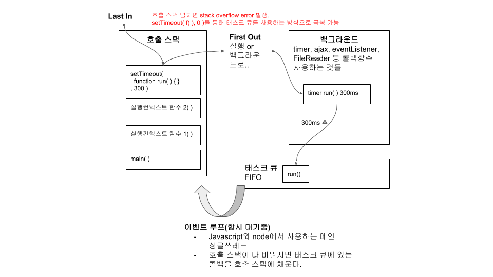

# Happ New Year Card

## 실행
- index.html | 새해 인사 카드 웹 실행
- test.html | 테스트 코드 웹 실행

## Code Structure
### New Year Card 코드
- html: index.html | Header, Section, Footer
- javascript: source.js | Source functions for event callback. Using namspace 'source'.
- javascript: event.js | Submit event handling. IIFE and Closure pattern apply.
- css: style.js

### Test 코드
#### Using mocha and chai library
- html: test.html
- js: source.test.js | Test return value of functions only which has return.

#### Scaffolding technique using custom assert function
- js: source.js | assert()

### 안정성 확보
- 전제조건
  1. Functional Programming을 만족하는 함수
- Mocha and Chai
  1. 함수의 처음 확인 | 자바스크립트 엔진 가동 시 함수가 정의 되었는지 확인
  2. 함수의 끝 확인 | 함수가 가상의 매개변수로부터 원하는 결과값을 반환하는지 확인
- assert 단정문 : [Programming Pearls 칼럼4, 칼럼5 참조](https://ginnyang2.github.io/Programming-Pearls/)
  1. 함수 내부에서 점검
  2. 함수 내부 실행의 처음 확인 | 함수로 들어오는 매개변수 유효성 확인
  3. 함수 내부 실행의 끝 확인 | 함수가 만든 반환값의 유효성 확인

### 서버와 연동
- eventListener의 콜백 안의 timer 콜백함수를 사용 | 서버 reponse 성공 시 timer 콜백함수가 실행되도록 해야함.

### Submit eventListener Throttling
- 과다 호출 방지 목적
- Throttle 구현([참조.에버노트 Throttle and Debounce](https://www.evernote.com/shard/s313/sh/1a86f967-3a6f-4e0c-9a09-379cde66d061/766256837ee81cd8726b2b4a0c1e74c0))
```
var timer; //timer가 함수 스코프에서 선언되면 if문에서 무조건 undefined이므로 event 발생할 때마다 서로 다른 timer에 각각 setTimeout이 정의되서 throttle 구현 실패한다.
document.querySelector('#input').addEventListener('input', function (e) {
     if (!timer) { //첫번째 event에서 timer가 setTimeout function으로 정의되면 200ms 이후 실행되기 전에 if문 안으로 못 들어간다. 즉, 새로운 setTimeout이 정의되지 않아 특정 시간 안에 첫번째 이벤트만 실행시키려는 throttle의 목적을 달성한다.
         timer = setTimeout(function() {
             timer = null; //첫번째 이벤트가 200ms 이후에 실행된 후 timer가 제거되야 eventListener가 새로운 setTimeout을 정의할 수 있다.
             console.log('여기에 마우스 스크롤 연동 애니메이션 이벤트', e.target.value);
         }, 200);
     }
});
```
- 호출 스택과 이벤트루프에 따른 실행순서
<p align="center">
  
</p>

## Libraries
- Mocha and Chai, only.
- Reason: For testing vanilla javascript code. Jest and Enzyme need node.js enviroment, it's too heavy to small application like this.
- Weakness Mocah/Chai compare to Jest/Enzyme: No mock event test, but can overcome with a scaffolding technique using custom assert function .

## Reference
- about Scaffolding and Test code : [Jon Bentley. Programming Pearls 2/E. insight. 칼럼4. 칼럼5.](https://ginnyang2.github.io/Programming-Pearls/)
- Mocha and Chai : Medium blog [Running Mocha Tests as Native ES6 Modules in a Browser](https://medium.com/dailyjs/running-mocha-tests-as-native-es6-modules-in-a-browser-882373f2ecb0)
- Throttling : [ZeroCho Blog-Javascript-쓰로틀링과 디바운싱](https://www.zerocho.com/category/JavaScript/post/59a8e9cb15ac0000182794fa)
- 호출 스택과 이벤트루프 : [ZeroCho Blog-Javascript-호출 스택과 이벤트루프](https://www.zerocho.com/category/JavaScript/post/597f34bbb428530018e8e6e2)
